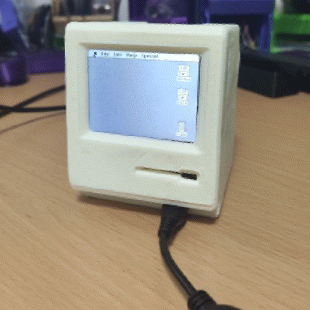
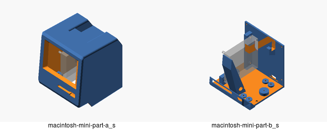
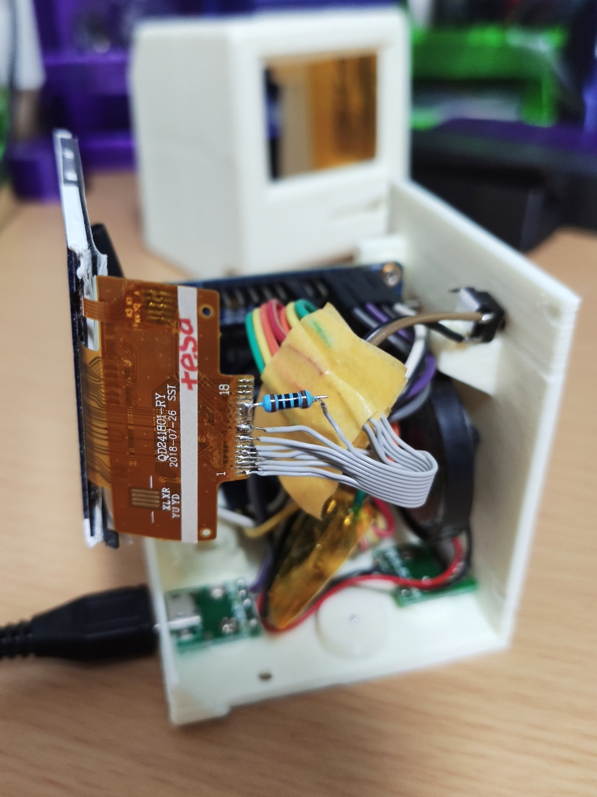
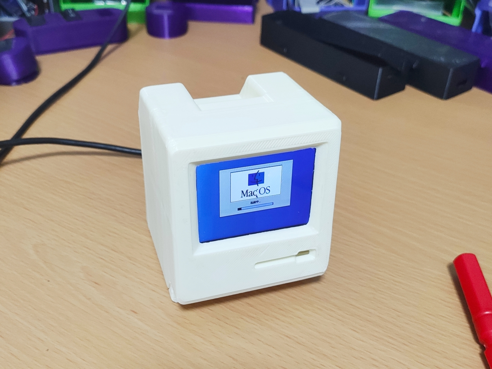
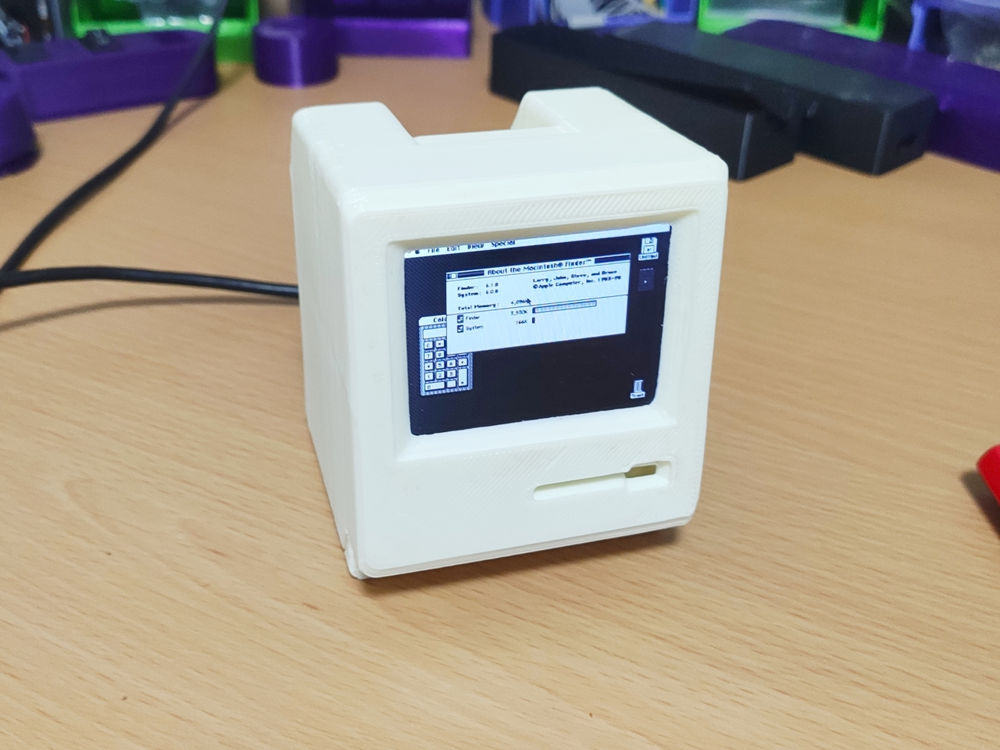
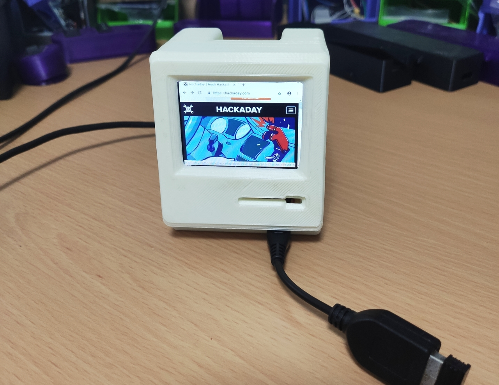
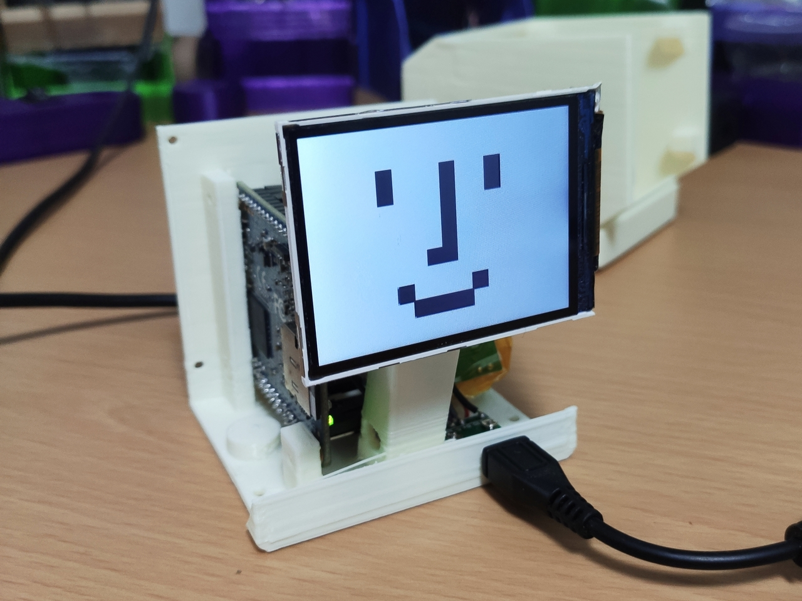
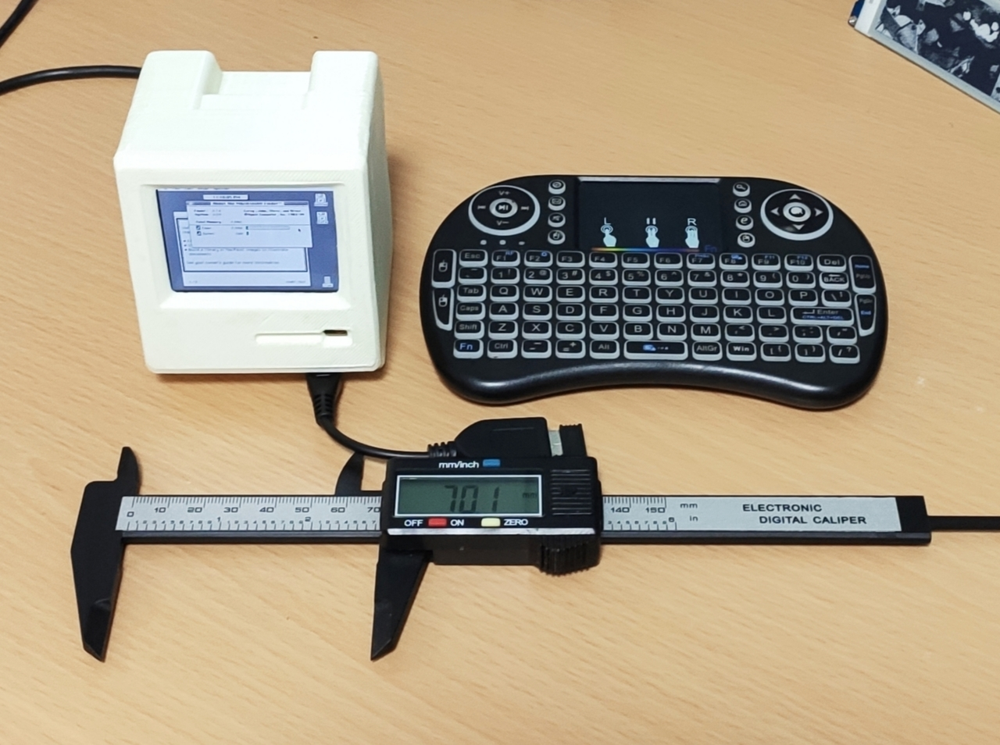
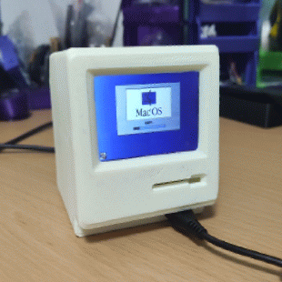

<p align="center">
  
</p>

# Mac(intosh) mini

## Build Instruction
- Print the outer shell.
  - PLA, 0.2 mm, 180 ℃ (See also [./openscad/README.md](./openscad/README.md))
  - `macintosh-mini-part-a.stl` ([stl](./openscad/macintosh-mini-part-a.stl))
  - `macintosh-mini-part-b.stl` ([stl](./openscad/macintosh-mini-part-b.stl))



- Setup your Orange Pi Zero Plus 2 (H3)
  - Install Armbian Bionic. https://www.armbian.com/orange-pi-zero-plus-2-h3/
  - Then SSH into the device.
```bash
$ sudo apt install -y git xtightvncserver

# Install Node.js
$ git clone https://github.com/tj/n /tmp/n && cd /tmp/n && sudo make install
$ sudo n v10

# Install https://github.com/xpertsavenue/WiringOP-Zero
$ git clone https://github.com/xpertsavenue/WiringOP-Zero
## Please refer to https://github.com/xpertsavenue/WiringOP-Zero

# Setup vncserver
$ mkdir .vnc
$ vncpasswd .vnc/passwd

# Install the dependencies & config files
$ git clone https://github.com/likeablob/macmini ~/macmini
$ cd ~/macmini
$ sudo ./install.sh

# copy ypur assests
$ cp /path/to/vmac.rom ~/macmini/minivmac/vmac.rom # Mini vMac ROM file
$ cp /path/to/vmac.dsk ~/macmini/minivmac/system.dsk # Mini vMac disk file
$ cp /path/to/.basilisk_ii_prefs ~/.basilisk_ii_prefs # Basilisk II config file
$ cp /path/to/macboot.wav ~/macmini/macboot.wav # Boot sound (optional)
```
- [Tips]: Here is my working [.basilisk_ii_prefs](basilisk_ii_prefs.md).
  
- Wire the display & USB boards to the OPi



| OPi            | Peripherals          |
| -------------- | -------------------- |
| PA15/SPI1_MOSI | LCD MOSI             |
| PA16/SPI1_MISO | LCD MISO             |
| PA14/SPI1_CLK  | LCD CLK              |
| PA13/SPI1_CS   | LCD CS               |
| PS12           | LCD RESET            |
| PA11           | LCD DC               |
| PA06           | Push Switch          |
| USB-DP2        | USB (Front) Data+    |
| USB-DM2        | USB (Front) Data-    |
| 5V             | USB (Front/Rear) 5V  |
| GND            | USB (Front/Rear) GND |

## Basic Concepts
1. At system boot, [`fbtft_device`](./config/fbtft.conf) kernel module is loaded and it initializes the LCD as `/dev/fb0`.
2. `nodm` starts an X session and `~/.xinitrc` get executed.
3. `~/.xinitrc` launchs `matchbox-window-manager` and `~/macmini/switcher/*js`.
4. `~/macmini/switcher/index.js` reads the scripts [`~/macmini/switcher/sh.d/*sh`](./switcher/sh.d/) and spawns them one by one when there is a HTTP GET request at `localhost:5501/`.
5. `~/macmini/switcher/gpio-reader.js` watchs the push SW at GPIO7(PA06) and send a request to `localhost:5501/`.

### How does the low-res LCD(320x240) handle 512x384 resolution?
Internally `xthighvncserver` and `ssvncviewer` are used to scale the display.
- e.g. [`1_large_minimac.sh`]((./switcher/sh.d/1_large_minimac.sh)) launches: 
  -  `xthighvncserver` to create a virtual display (512x384) at `DISPLAY=:1` (`:5901`)
  -  `minivmac` in `DISPLAY:1`
  -  `ssvncviewer -scale 0.625` in `DISPLAY:0` (By the `-scale` option, low-res LED get upscaled)
## Gallery
|   |   |
| :-------------------------------------------------------------------------: | :-------------------------------------------------------------------------: |
|  |  |
|  |  |
|   |   |


## BOM
| Name                                                    | Quantity | Descriptions            |
| ------------------------------------------------------- | :------: | ----------------------- |
| OrangePi Zero Plus 2 (H3)                               |    1     | H5 ver. might work too. |
| 2.4inch SPI Display (ili9340, 320x240, with flat cable) |    1     |                         |
| Generic micro-USB Breakout Board                        |    2     |                         |
| M2 x 6 mm Self Tapping Screw                            |    16    |                         |
| D10mm Rounding Magnet                                   |    2     |                         |
| 7x7 mm Push Switch                                      |    1     |                         |

## Acknowledgment
- Mini vMac https://www.gryphel.com/c/minivmac/
- Basilisk II https://basilisk.cebix.net/
- Kudos to all the devs!s

