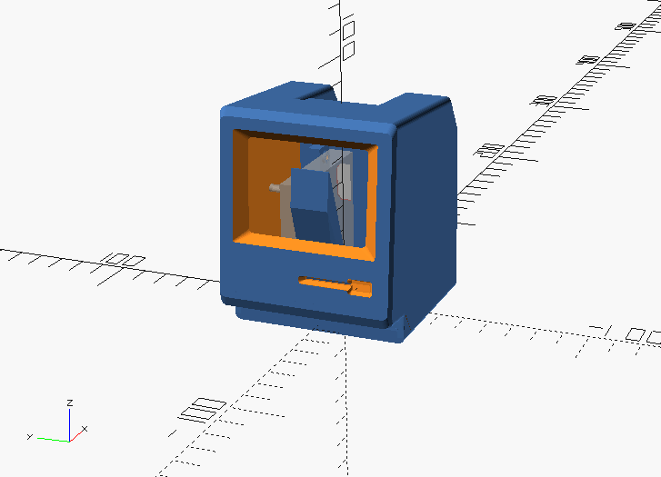

<p align="center">
  
</p>

## Print conditions
- PLA, 0.2 mm, 180 ℃
- `macintosh-mini-part-a`: Rotate so that the -X(front) side is facing down.


## Dependencies
- [OskarLinde]'s [scad-utils](https://github.com/OskarLinde/scad-utils)
- openscad-nightly (`20181009T230242.gitf3de0e27+2416.1`)

## Build
```sh
$ git submodule update --init --recursive # or git clone --recursive
$ make -j4
```

